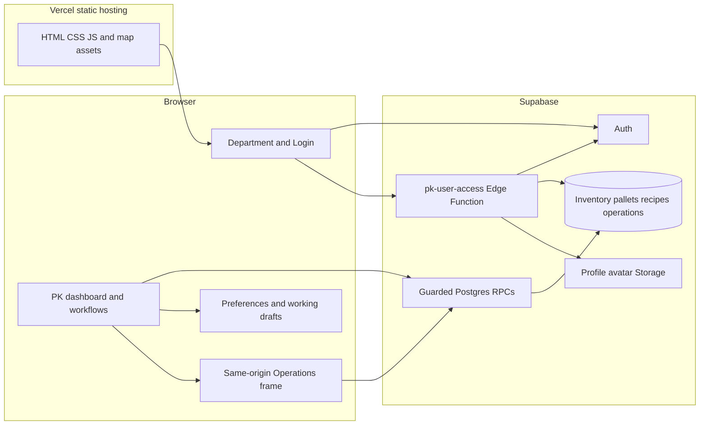

# PK WMS — architecture

Evidence baseline: 9 October 2026. **Observed** means code/config/database metadata was inspected; **proposed** means not yet shipped; **unknown** means not measured. Product contract: [PRD.md](PRD.md). Visual contract: [DESIGN_SYSTEM.md](DESIGN_SYSTEM.md). Agent entry: [AGENTS.md](AGENTS.md).

## Product vision and principles

One Thai packaging warehouse UI for stock, pallet movements, recipes and work tracking. Preserve units, history and optimistic concurrency. Authentication and authorization belong on the server; browser visibility is only UX. Multi-device operational state belongs in the database. Browser preferences/drafts have distinct ownership and must not be treated as disposable stock caches.

## Architecture overview — observed

## Components and data authority

| Layer / entity | Authority and paths | Copies and limitations |
|---|---|---|
| Site shell | Root static HTML and feature JS; Vercel config | No npm build step; CSS cascade carries older overrides |
| Accounts and identity | Supabase Auth plus active `app_users`; account Edge Function | Browser session determines credentials presented; server validates actor/role |
| Stock snapshots | `stock_inventory_snapshots`, guarded stock RPCs | Dashboard aggregates derive from snapshot items; browser starts empty and loads an authorized snapshot; no embedded stock fallback |
| Pallet state / history | Server pallet/movement RPCs and expected versions | Browser edit state and map are projections, not write authority |
| Legacy BOM baseline | `pk_bom_baselines` via `get_pk_bom_baseline`; RLS, no direct API-role access | 757 raw recipes / 3,476 lines, 758 FG catalog entries; exact Operations variant preserves 756 recipes |
| Saved recipes | `pk_recipes`, `pk_recipe_lines`, `pk_recipe_versions`; Admin save RPC | 0 editable recipes at migration; saved recipes override the private baseline by FG code without overwriting source data |
| Work tracking | `warehouse_ops` private tables through `warehouse_ops_rpc` | Operations UI is a same-origin frame; its server gateway checks PK Admin |
| Avatar | Edge Function validates caller/file and writes Storage | Profile URLs may be public; they must not include credentials |
| Drafts/preferences | Browser local/session storage | Counts, BOM drafts and calendar fallback contain business work; targeted cleanup preserves them |
| Receipt plan | Referenced Google Sheets export | Network refresh/freshness is separate from inventory snapshot time |

The schema and database installed today are authoritative for API guards. Some early root SQL scripts still show superseded anon grants; do not replay a single old script in isolation and assume it matches the deployed permission model.

## Stock and BOM API contract — verified live

Base API: `https://zgsxbuckjrplkpvtlbmn.supabase.co/rest/v1/rpc/`.

| Function | Result / parameters | Access |
|---|---|---|
| `get_latest_stock_inventory` | Latest stock JSON including snapshot save time; no arguments | authenticated plus stock/reorder/BOM/planning/reconciliation menu guard; anon EXECUTE revoked |
| `get_pk_bom_baseline` | Private legacy BOM, FG catalog, Operations variant and provenance hash; no arguments | authenticated plus BOM/planning or active Admin; anon EXECUTE revoked; direct table reads denied |
| `get_pk_recipes` | Saved recipe headers with lines; no arguments | authenticated plus BOM or planning menu; anon EXECUTE revoked |
| `get_pk_recipe_versions` | Version history; `p_fg_code` | active Admin; anon EXECUTE revoked |
| `save_pk_recipe` | Save with `p_recipe`, `p_expected_version` | active Admin; version conflict rejects stale edit |
| `get_withdrawal_stock_catalog` | Codes/names/units/freshness, not stock quantities or values | Explicit anon grant for a separate dependent app; decision required before changing its contract |

Supabase JS calls RPC with the current Auth session; raw HTTP callers need the project's browser key and the user's Bearer access token. Server service keys never belong in the browser. [Supabase RPC documentation](https://supabase.com/docs/reference/javascript/rpc).

## Transaction and failure boundaries

Observed recipe saving uses a database transaction/version check to save header, lines and history together. Pallet copying carries source/destination version information; copying to the same zone is a supported operation and must preserve source receipts. Profile administration crosses Auth, profile rows and Storage; do not describe all those calls as one atomic transaction. Test partial failures when changing them.

API failures must not be reported as successful writes. Stock and recipe loading should expose loading/error/empty/ready separately. On logout or permission changes, privileged projections must be cleared and stale async responses discarded. A fallback used for availability cannot silently override a confidentiality requirement.

## Security and deployment boundaries

Observed: Vercel security headers allow same-origin Operations frames and camera use. CSP still permits inline scripts for the existing HTML. All public regular/partitioned tables had RLS enabled at the audit; SECURITY DEFINER RPCs still need individual guard review. `.vercelignore` excludes SQL, docs, tests, tools, server function sources, environment files and working artifacts. The public Git repository/history is a separate publication surface; excluding files from Vercel does not make Git history private.

## Completed migration: remove current public stock/BOM fallback

Imported the complete original and Operations formula variants into a private versioned baseline on 9 October. All 104 batches matched their source JSON before the baseline was marked ready. Missing FG units and duplicate/raw lines were preserved, not guessed or merged. The public root DATA is empty and operations/pk-bom.json is removed. API failures clear privileged projections; logout discards late responses. See [migration evidence and rollback](docs/PRIVATE-DATA-MIGRATION-2026-10-09.md).

This removes fallback from the current website. Previously published Git commits, old deployments and third-party copies were not erased. The separate public withdrawal catalog remains an explicit integration decision.

## Evidence ledger and limits

| Claim | Classification | Evidence |
|---|---|---|
| Static site with Supabase and no root build | Observed | Root HTML, feature modules, config and README |
| Guarded stock/recipe reads | Observed | Live function definitions and role EXECUTE metadata on 9 October |
| 96 unit tests and browser checks passed at audit | Reported with artifacts | [Audit report](docs/SECURITY-AUDIT-2026-10-09.md) |
| Current stock/BOM fallback removed; baseline migrated | Observed | Source diff, 104 database content checks and private API browser tests; migration report |
| Long-term uptime/load capacity, backup restore guarantees | Unknown | No sustained production load/restore drill conducted |

This document maps the current system. It does not authorize unrelated framework migrations or claim complete security certification. Source skill provenance: [docs/SKILLS.md](docs/SKILLS.md).
