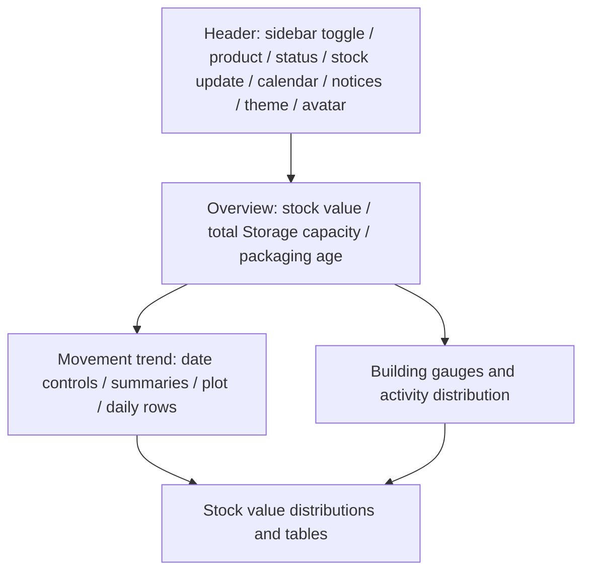

# PK WMS — Design System

Version 1.1, 9 October 2026. Current implementation reference for [PRD.md](PRD.md), [ARCHITECTURE.md](ARCHITECTURE.md) and [AGENTS.md](AGENTS.md). This documents the final reference WMS theme, not the earlier charcoal/lime theme.

## Foundations

Runtime tokens come from `reference-wms.css`, which overrides `haulix-theme.css`. `dashboard-layout.css` sets Dashboard layout. Feature CSS owns local controls; inspect computed styles after all stylesheets load. `DESIGN.md` is a compatibility pointer to this document rather than a second palette.

| Semantic token | Light | Dark | Role |
|---|---|---|---|
| `--page-plane` | #f1f3f5 | #15242b | Page canvas |
| `--surface-1` | #ffffff | #1e3038 | Cards/header |
| `--surface-2` | #f7f9fa | #253b44 | Nested surfaces |
| `--text-primary` | #23313a | #edf4f7 | Main text |
| `--text-secondary` | #52616a | #bdd0d9 | Secondary text |
| `--text-muted` | #6d7b84 | #a0b6c1 | Hints |
| `--border` | #e0e6ea | #354b57 | Dividers/controls |
| `--series-1` | #267457 | #9ed5ba | Primary interactive accent |
| `--nav-ink` | #f9fafb | #1b2c34 | Sidebar background |
| `--nav-active` | #dff1e8 | #294f44 | Selected menu |
| `--nav-text` | #4b5963 | #c9d9df | Sidebar labels/icons |
| `--focus-ring` | #4b9e80 | #9ed5ba | Visible focus |

Default theme is dark; users explicitly select light/dark and preference persists in `pk-dashboard-theme-haulix`. Do not silently substitute OS auto-dark. New components should reference semantic CSS variables; raw values above are documentation of the current palette.

Noto Sans Thai is served locally through `typography.css`. Use the existing type scale: 22px page title, 18px section title, generally 14px body/control text; mobile pallet form fields use 16px to avoid browser zoom. Main panel/control radii are 14px/10px. Dashboard gap/padding: 18px/22px desktop, 12px/16px mobile. Prefer 44px interactive touch targets; existing smaller controls need individual checks rather than a blanket accessibility compliance claim.

## Layout and component anatomy

Dashboard cards prioritize values with labels, context and units. Do not flatten different units into one total. Empty/error states must remain distinct from zero activity. Tables scroll inside their region on narrow screens; they must not widen the page.

## Component specifications

| Component | Anatomy / variants | States and usage | Accessibility |
|---|---|---|---|
| Sidebar | Logo, icon, menu label, optional badge; 64px rail or full width; mobile drawer | Default collapsed; icon rows retain equal height. BOM and Cycle Counts labels wrap with badges on a separate row when expanded. Desktop navigation expands over the page while reserving a constant 64px rail; content position and width remain unchanged. Pointer hover expands the whole sidebar temporarily; pointer leave restores the collapsed rail. Keyboard focus also reveals the full navigation. Toggle pins expansion. No floating menu-name labels. Active uses nav tokens. | Accessible toggle name/expanded state; drawer Escape/backdrop close, focus restoration and inert background |
| Header icon button | 20–21px line SVG in consistent control; optional count badge | Stock update matches calendar/notification controls. Hover/focus/disabled/loading should preserve shape. No duplicate full-text stock update bar. | Name through aria-label/title; count meaningful to screen readers |
| Account/profile | Avatar or initials, name/role, Settings actions | Change name/PIN/password/avatar in Settings; avatar menu can show account, change department and logout. No avatar-upload action there. | Buttons have names; input errors use status; photo does not replace text identity |
| Gauge | Track, ordered color bands, dotted needle, percentage, used/total context | Same visual grammar for total and per-building capacity. Full arc green→yellow→red left-to-right. Needle settles on actual percent; bands are not three unrelated gauges. | Numeric text and denominator remain readable without color; SVG should not duplicate the spoken label |
| Trend chart | Date/period controls, legends, lines/points, daily rows | Same source summary as activity donut. Finite reveal on entry/update. Do not show a fabricated trend for empty periods. | Legends and daily data provide text access; controls keyboard-operable |
| Stock card/form | Product context, history rows, quantity/unit, action buttons | Dark surfaces/text from tokens; distinguish receive/issue/return beyond color. No dark text on dark row backgrounds. | Label all fields; errors visible; horizontal scroll region focusable |
| Map controls | Zoom %, minus/plus, rotate, reset, fullscreen; separate map viewport | Normal mobile reserves space outside map; fullscreen arrangement must preserve usable map height. Do not overlay an oversized wrapping toolbar on zones. | Touch and keyboard controls, named buttons, focus preserved when changing layout |

## Data presentation states

Use these states for Dashboard, stock and BOM data panels. These are component requirements; existing status notices implement part of this contract. Dedicated panel placeholders still require implementation if introduced in a later UI change.

| State | Display and actions | Tokens / accessible behavior |
|---|---|---|
| Locked | Explain Login/menu access; do not display privileged prior-account values | surface-1, text-secondary; keep Login/navigation available |
| Loading | Show a status near the relevant panel; do not label an unloaded value as confirmed zero | text-muted; status announcement should not repeatedly interrupt focus |
| Error | Explain load failure and offer retry; do not substitute public fallback | text-primary on surface-1; error text plus named retry control |
| Empty | State that the loaded result has no records in the selected period | text-secondary; preserve date/search controls |
| Ready | Show actual value with unit, denominator and data date where applicable | text-primary; gauges/charts provide numeric/text alternatives |

Related components: header freshness notice, gauge, trend chart, stock tables and BOM load status. Use the existing component specifications above for their shared anatomy and variants.

## Motion

Use existing finite animation routines rather than adding a dependency. Desktop sidebar width uses 340ms `cubic-bezier(.4,0,.2,1)`; mobile drawer uses 320ms; hover expansion uses the same desktop transition with a 120ms pointer-leave delay. Gauge/progress and trend reveals are approximately 1100ms where currently implemented. These are implementation values, not permission to animate every element continuously.

Honor `prefers-reduced-motion: reduce`; cancel stale chart animations when data or view changes. Avoid display/layout jumps while labels fade. Gauge colors stay in green/yellow/red order regardless of percentage. Changing a date must update both chart and summary data, not only animate old data.

## Correct and incorrect usage

| Correct | Incorrect and reason |
|---|---|
| Point at the sidebar and expand its menus | Restore floating labels; superseded by automatic sidebar expansion |
| Use one capacity gauge grammar for buildings and total | Mix old thick colored dial with new dotted-needle gauges |
| Use icon stock update beside calendar with accessible name | Repeat a full-width update bar and header button |
| Display profile photo in header and edit in Settings | Restore upload button in account dropdown |
| Use final theme tokens on stock-card headings | Reuse old hardcoded dark text on dark backgrounds |
| Reserve controls above/beside mobile map | Put a tall wrapping toolbar across pallet zones |

## Validation and governance

For affected components select existing browser tests: sidebar/hover, dashboard layout, building gauge, trend motion, map controls, settings and theme. Include relevant mobile/light/dark/reduced-motion states. Audit reported passing browser fixtures, not physical-device coverage or full WCAG certification. Measure contrast for changed pairs and check keyboard/screen-reader names before claiming accessibility compliance.

Update this document with component changes; keep [PRD.md](PRD.md) requirements and [ARCHITECTURE.md](ARCHITECTURE.md) ownership aligned. Source evidence: `reference-wms.css`, `sidebar-toggle.css`, `dashboard-layout.css`, `dashboard-motion.js`, `typography.css`, `account-status.js`, `floorplan-mobile-controls.css`.

## Changelog

- 1.1 — 2026-10-09: Defined locked/loading/error/empty/ready presentation requirements and separated them from currently verified UI behavior.

- 1.0 — 2026-10-09: Documented current reference WMS tokens/components, mobile behavior and motion; replaced stale green/lime design guidance with a compatibility link. Created with `design-system-doc`; sources in [docs/SKILLS.md](docs/SKILLS.md).

Movement analysis uses compact 18px desktop/16px mobile card padding, an 840px maximum trend SVG width, 145px building gauges and a 105px activity donut. Text, date controls, chart data and motion remain unchanged.
